# Gradle Tutorial

Welcome to the step by step of Class Assignment number 2, Part 1.
In this tutorial you're going to learn how to use Gradle.

# 1. Copy the Gradle Basic Demo

1.1 Copy the Gradle Basic Demo from https://bitbucket.org/luisnogueira/gradle_basic_demo.  
     

1.2 Paste it into your working directory and open it with your IDE.  

   
1.3. Go to the Readme file, guarantee that you have the necessary Prerequisites and then commit your version
of the App.

# 2. Experiment with the App

Using the original Readme from the App, open a command line in the project's root folder and perform the following tasks:

2.1 Build a .jar file using _./gradlew build_

The output should look like this

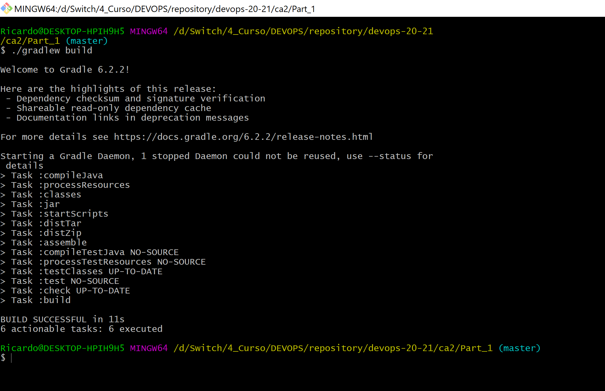

2.2 Use the following command to initiate the chat server in a valid port.  
   (For example, substitute < server port > for _59001_)

_java -cp build/libs/basic_demo-0.1.0.jar basic_demo.ChatServerApp < server port >_

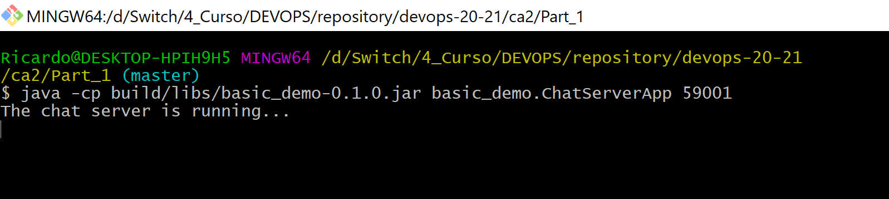


2.3 Run the Client by opening another command line in the same directory (while keeping the previous one open).  
   On this new tab execute the command _./gradlew runClient_

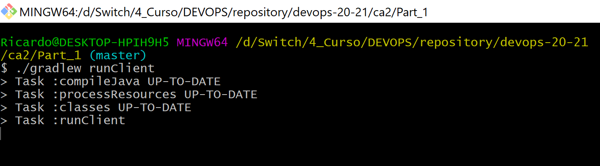

A pop-up should open asking you to select a screen name

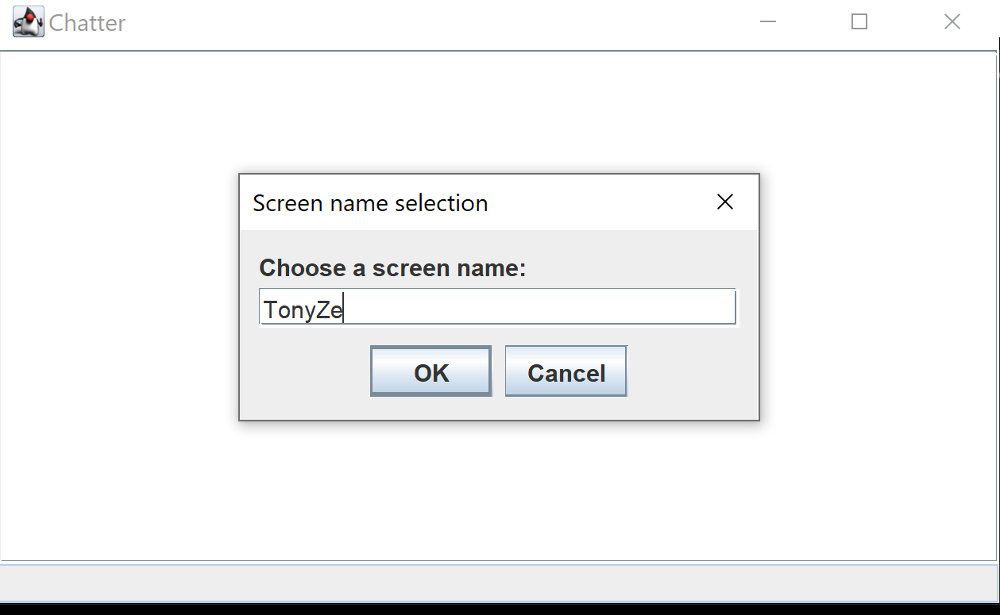

If you want to have some interaction open another terminal, and run the command again, creating a new
"user" and selecting the screen name.  

Now you can have a conversation with yourself (Doesn't seem like a great plan, but who am I to judge?)

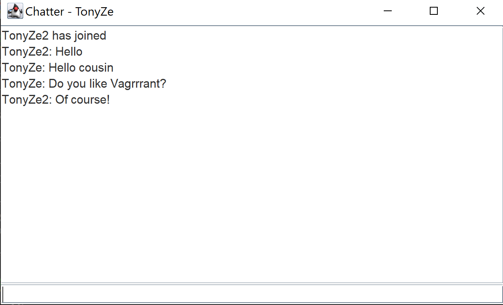


# 3. Create a task to automatically execute the server

3.1 Open the build.gradle and create a task that executes a server in the defined port.  
   
   As the project already contains a task to open the chat client on port 59001, I recommend you use the same port for this task.

   ```java

   task runServer(type: JavaExec, dependsOn: classes){
   group = "Devops"
   description = "Launches a server on port 59001, that allows chat clients to connect"

   classpath = sourceSets.main.runtimeClasspath

   main = 'basic_demo.ChatServerApp'

   args '59001'
   }
   
   ```

3.2 Test the task by opening a command line in your _basic_demo_ folder and using the _./gradlew runServer_ (runServer or other name you provide to the task) command.

   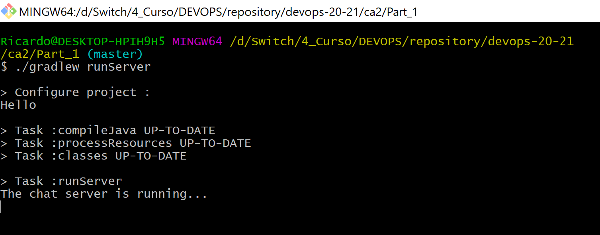

# 4. Add a Unit Test

4.1 Create a Test Directory on your project that follows the path _src\test\java\basic_demo_ and guarantee it also has a resources folder.
   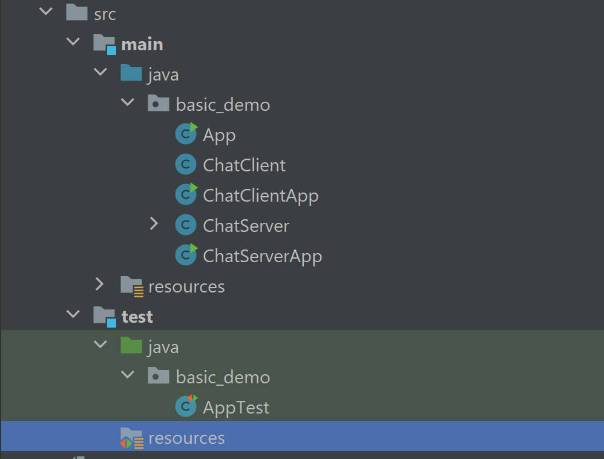   

   Create a Class named _AppTest_ and copy the following code for that Class:

```java

package basic_demo;
import org.junit.Test;
import static org.junit.Assert.*;

public class AppTest {
        @Test
        public void testAppHasAGreeting() { 
        App classUnderTest = new App();
        assertNotNull("app should have a greeting", classUnderTest.getGreeting());
        }
    }
    
```

4.2 Some things will appear highlighted in red. This is because you didn't add the junit dependencies yet.  
   
   Go to the _build.gradle_ file and add the dependencies to JUnit 4.12 in order for this to work: _testImplementation 'junit:junit:4.12'_ and
   _implementation 'junit:junit:4.12'_.

```java
dependencies {
    // Use Apache Log4J for logging
    implementation group: 'org.apache.logging.log4j', name: 'log4j-api', version: '2.11.2'
    implementation group: 'org.apache.logging.log4j', name: 'log4j-core', version: '2.11.2'
    implementation 'junit:junit:4.12'
    testImplementation 'junit:junit:4.12'
}
```

4.3 Build the project to verify if it is compiling correctly, using _./gradlew build_ in the command line.

4.4 Execute the command _./gradlew test_ in order to run the tests

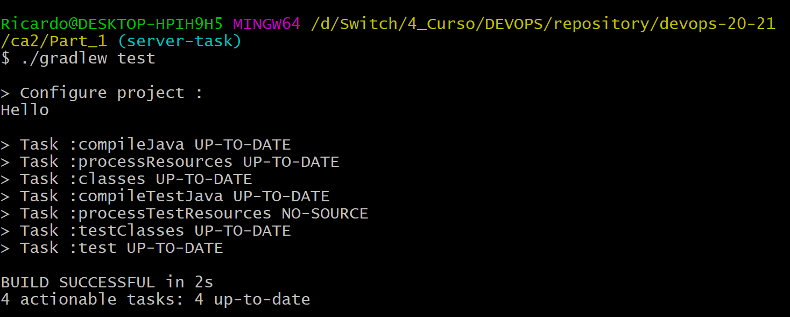

**On a side Note** If you want an elaborate report of what's happening behind the scenes you can use _./gradlew clean test --scan_
It will generate a report like this:
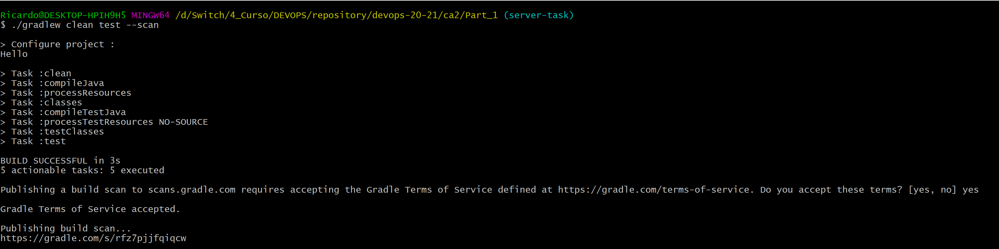

You can then use the link to see the report:
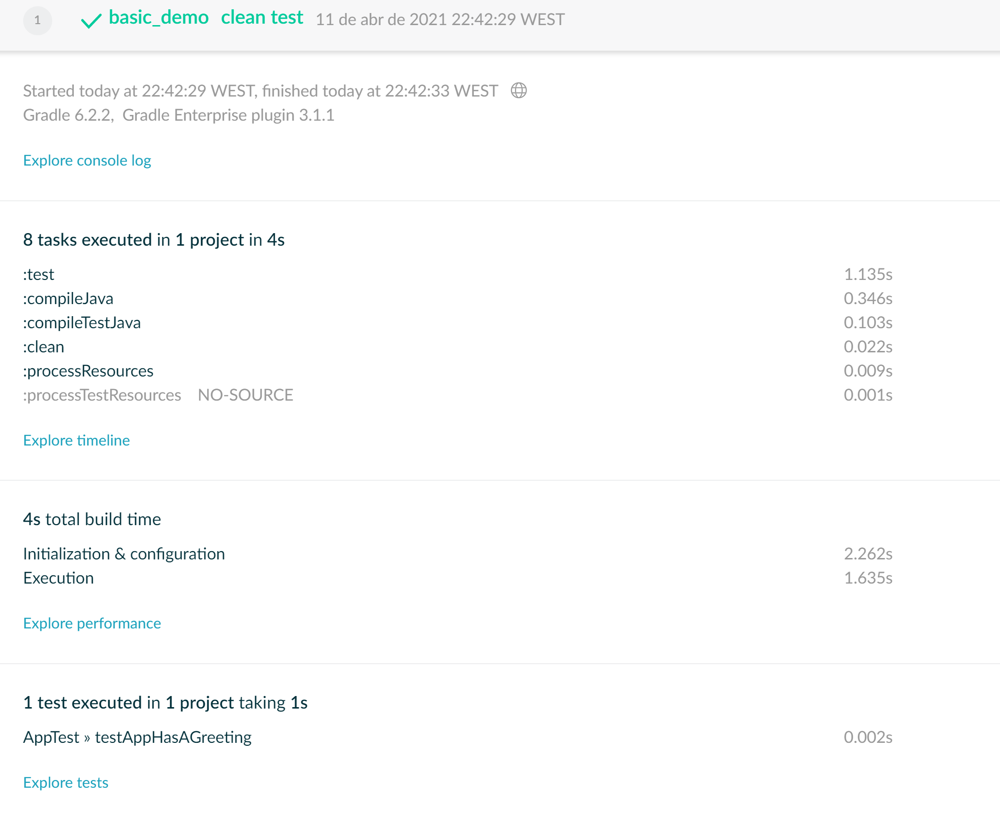

And you can even see the details for the Tests:

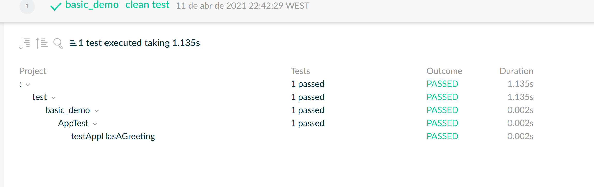

# 5. Add a Copy task

5.1 Create a task in _build.gradle_ that creates a Copy of the _src_ folder

```java

task backup(type: Copy) {
from 'src'
into 'backup'
}

```

5.2 Open the command line and run the new task you've just created _./gradlew < task name >_

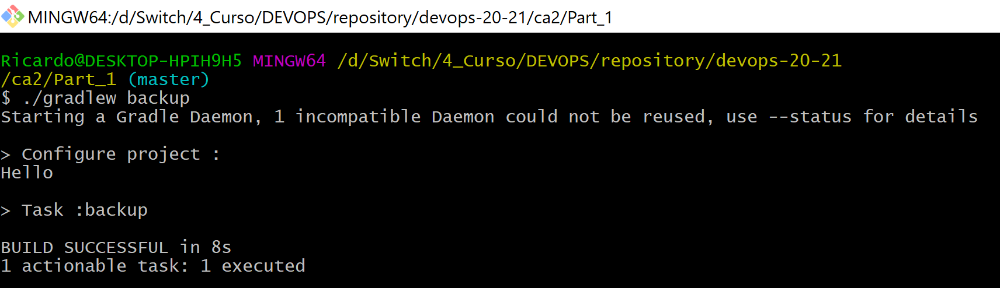

5.3 After running the task verify in your working directory if a backup folder has been created and if it contains the intended information (src folder)

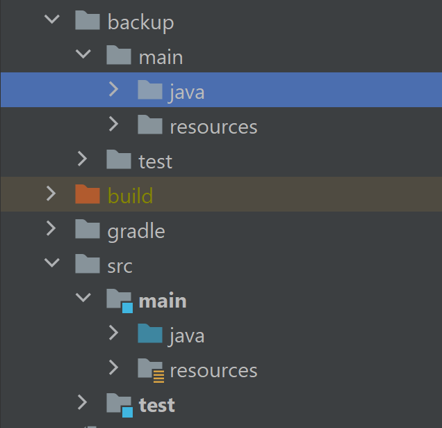

# 6. Creating a Zip task

6.1 Add a task in your _build.gradle_ file to create a _zipped src folder_. You should define what you want to zip (_from_), where you want to place it (_destinationDirectory_) and how you want to name it (_archiveFileName_).

```java

task zipFolder (type: Zip){
    from 'src'
    archiveFileName = "zippedSrc.zip"
    destinationDirectory = file("/zippedSrc/")
}

```

6.2 Open the command line in your working directory and run the _./gradlew < task name >_

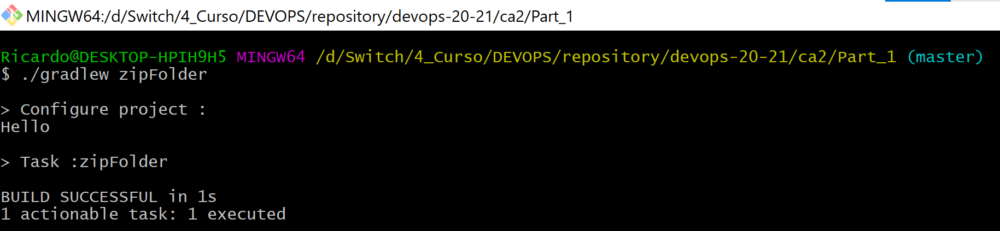

6.3 Look into your project structure and verify if it created the file on the specified folder

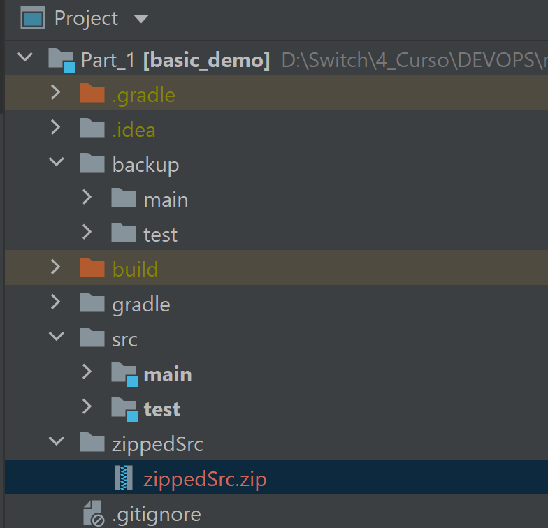

## Congratulations! You just finished the first part of your CA2 Assignment! 
## Now, create a tag named _ca2-part1_ and add it to your repository.

## You can now go to an outdoor bar and have yourself a cold Sommersby or a _bagaço_ (_bagace_ in English).