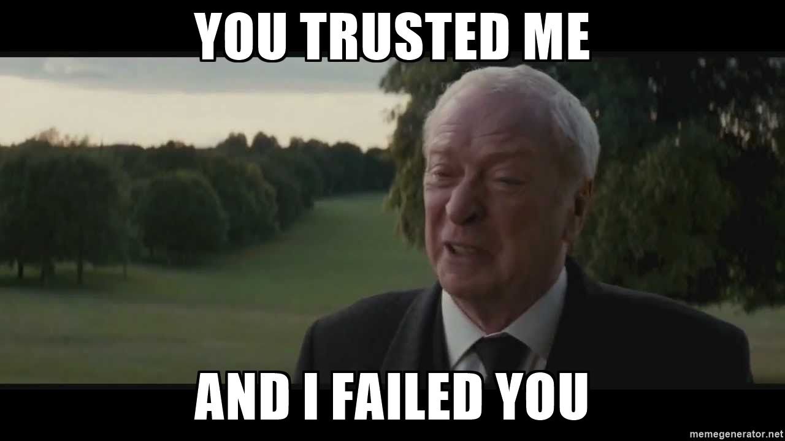
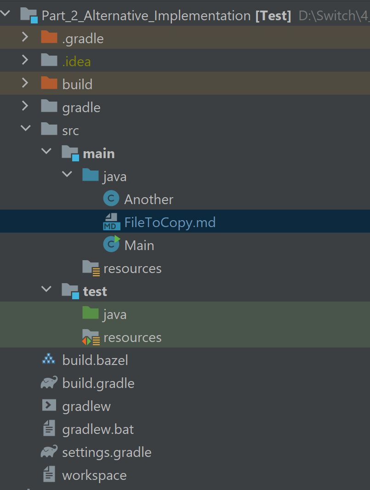
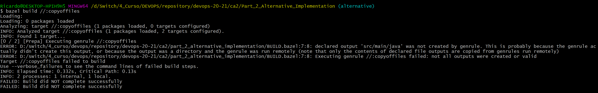
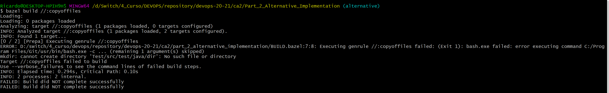
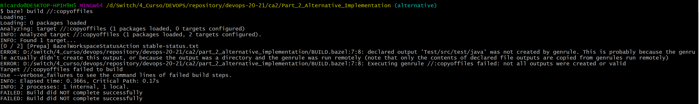
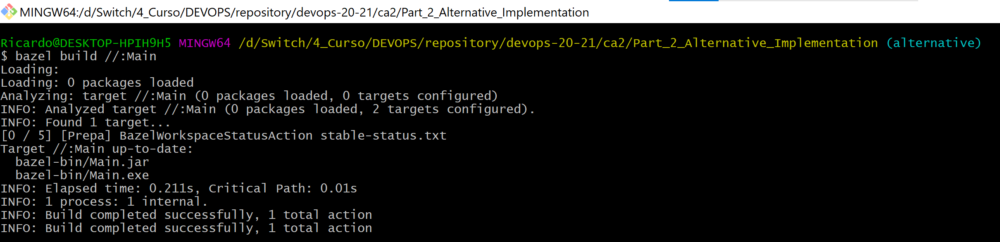
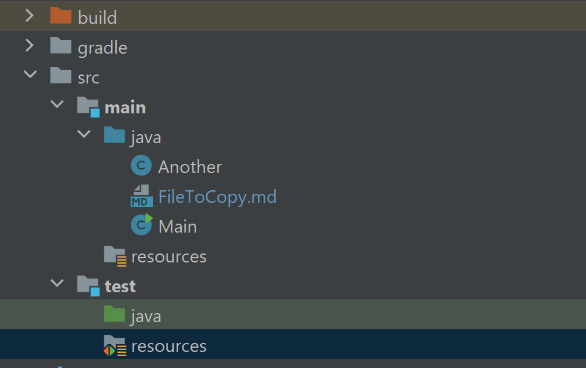
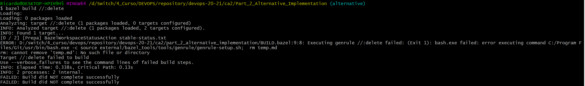
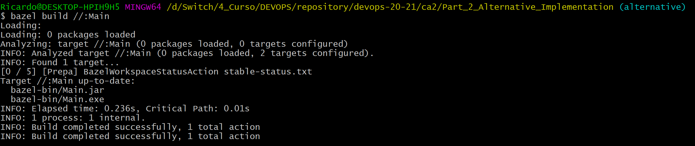

# Alternative Implementation

In this section we're going to discuss an alternative to Gradle. The chosen one (Frodo...???) is going to be Bazel.

## 1. Analysis

Bazel is a Build Tool designed by Google. As other build tools its purpose is to build software applications through source code, following certain rules.

## Comparison between Bazel and Gradle

Regarding Java projects, Bazel is supposed to have its better performance, recurring to a build granularity way finer than Gradle (I know, it sounds confusing...).
This means that, while Gradle has a single _build file_ and uses a more "generic" approach, Bazel needs more "detail" in order to obtain the best results. In order to achieve the best performance in Bazel, it is recommended to have a _build file_ for each package of the project. While this could be good, because it allows for clearer specifications, it could be a real pain in a project with a large number of packages.

In terms of extensibility, both alternatives allow for customisation. This means that you can add custom tasks or plugins, in order to allow for increased customisation.

Spring Boot Support is an issue in Bazel, since there is no official plugin unlike what happens with Gradle, which is fully supported. This could be an obstacle in terms of trying to replicate the CA2-PART2 implementation, using Bazel as an alternative to Gradle. Some or all features may not be possible to reproduce using Bazel.

## Implementing the solution

The solution implementation is complicated (we will see later on, that you actually need to sell your soul to the Devil). While there seems to be ease of extensibility while using Bazel, i.e. you can create specific tasks and modularize your build, there is no native support for Spring Boot. Currently, only Gradle and Maven have native support from Spring Boot.

This means that, even though you can create the project and add some tasks, most likely, Spring Boot will not be supported.

Having this in mind we're going to try a step by step approach and try to implement the most, even though we know from the start, that Spring Boot framework is going to be unlikely used in this alternative implementation.


## 3 days later...

_At the midpoint of the journey of life I found myself in a dark forest..._

Following the steps of Dante, I've reached the ninth circle of Hell. After greeting some of the worst treacherous beings that ever lived, like Judas, Brutus and Nuno Casteleira, I started to hear a deep voice...I went down the stairs and I saw a scenario of woe and cruelty...Many Devs trying to learn BAZEL! I knew I'd reached the tenth circle of Hell...


## After trying for several iterations

Unfortunately all the attempts to try and achieve the desired state, were unsuccessful. Even after the teacher indication to only try to implement tasks 13 and 14 of the CA2 (Create taks to copy the jar file and delete files before the build) in this alternative implementation, I didn't succeed.



So, what I indeed managed to do was follow the simple steps of creating a very simple Application and "aplying" Bazel to it.

I managed to successfully build through Bazel and I managed to "create" tasks regarding items 13 and 14 of the CA2. The problem is, the tasks appear to be running. I even defined that the build depends on this tasks. So, the tasks are running before the build but they simply aren't doing what they are supposed to do (copy or delete something).

So, in the next step I'm going to perform a walkthrough of what I managed to implement using Bazel.

I'm focusing only on the 13th and 14th tasks, since the previous part of the CA2 was already successfully implemented through Gradle. My intention is to at least show something related to Bazel implementing.


# 1. Starting with Bazel

1.1 Go to https://docs.bazel.build/versions/master/install.html, select your OS and follow the steps to install Bazel on your working station.

1.2 Now, you can go to https://docs.bazel.build/versions/master/tutorial/java.html and try to replicate the steps.

1.3 Now that you've sold your soul to the Devil in order to make things work, let's continue.

# 2. BUILD.bazel file

Using a very simple project example, lets configure the file that is going to tell Bazel how to compile the project.

In this example the project is comprised of a Java Project using Gradle as the initial Build Tool.

The structure is as follows:



2.1 Let's start by using the command line to create a workspace file. Open the command line in your working directory and use _touch workspace_

2.2 Now repeat the first step and create a text file named _BUILD_

2.3 You can install the Bazel plugin in IntelliJ and create a new file with the _bazel extension_.

2.4 Now, go to the _build.bazel_ and create a _java_binary_ rule, in order to tell Bazel how to compile your project.

It should look like this:

```java
java_binary(
    name = "Main",
    srcs = glob(["src/main/java/Main.java"]),
)
```

(In the tutorial linked in 1.2 it specifies the syntax used in Bazel)

Basically you're naming the build task as "Main" and telling Bazel where it is located the Main Class (The one with the main method).

2.5 Now, let's build the project. Go to the command line and type _bazel build //:Main_ (Main could be substituted by any other name you give to the build task).


2.6 Success! Now comes the hardest part...The one where grown men cry...the one where not even the Devil wants to help you...

# 3. Tasks

3.1 As you may have noticed by now, I had many difficulties in order to try and make things work. Truth is, the tasks are executed, but they simply don't do what they are supposed to do. This frustrated me a lot. Unfortunately in all my research and iterations (believe me, there were many...) I could not understand why the task/general rule does not do what it is implemented.

One of the issues regarding Bazel is the lack of proper documentation. Actualized and with a correct explanation.

This being said, I'm gonna stop crying and simply demonstrate what I've done.

3.2 In order to try to copy some file to a differente folder a genrule (fancy way to designate a task in Bazel) should have the following structure:

```java
genrule(
name = "copyoffiles",
srcs = ["src/main/java/CopyTarget.md"],
cmd = " cp $(SRCS) $(@D) ",
outs = ["Test/src/test/java"],
)
```

The name of the task, the path to copy from, the command to copy and the output path.

When I try to run the task alone, it fails.

I have made many changes. Adding a _mkdir_ in the _cmd_ part, defining the output in different places, etc...

But never had success. Some of the errors:





For all of them my research never returned any detailed explanation or working solution.

However, I can create a dependency in the _Main_ task and make it depend on this copy files task.


```java
java_binary(
    name = "Main",
    srcs = glob(["src/main/java/Main.java"]),
    deps = [":copyoffiles"],
)

genrule(
name = "copyoffiles",
srcs = ["src/main/java/FileToCopy.md"],
cmd = " cp $(SRCS) $(@D) ",
outs = ["src/main/java"],
)
``` 

When I do this I have a successful build. Which means this task is actually running before the build (or at least I think it is...). 



But when the build finishes nothing happens...No file was copied...



Same thing happens for the _delete_ file task...

```java
genrule(
name = "delete",
srcs = ["src/main/java/temp.md"],
cmd = " rm temp.md ",
outs = ["src/main/java"],
)
```

Same type of errors when Main does not depend on this task, same type of "success" when the Main depends on the task:





## In the future I will continue to try to amend this issues and see if I can make Bazel work. For now, I'm going to eat something and get some sleep, because Bazel sure drained the life force out of me.